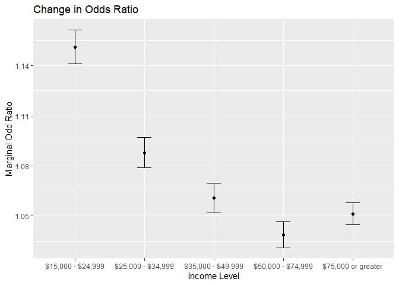

Health_Data_Analysis
================
Nathalie
2023-07-21

## Introduction

In recent decades, the escalating prevalence of obesity in the United
States has emerged as a critical public health concern, necessitating an
exploration into the factors which drive the condition. This analysis
delves into the relationship between household income levels and obesity
rates across different states in the U.S. By scrutinizing the
intersection of socio-economic disparities and health outcomes. Through
a comprehensive exploration of available data, the aim is to discern
patterns which are key to understanding how the condition presents
itself across income classes.

## Data

The data for this analysis is sourced from the [CDC’s Nutrition,
Physical
Activity](https://data.cdc.gov/Nutrition-Physical-Activity-and-Obesity/Nutrition-Physical-Activity-and-Obesity-Behavioral/hn4x-zwk7).
The dimensions of the CDC’s data is 88,600 rows and 33 columns. The data
set consists of measures/questions of interest (example: *Percent of
adult population with obesity*) aggregated across various dimensions of
interest (examples: *state, socio-economic class, race, etc…*).

## Process

### Data Cleaning

In order to make use of the data some cleaning of the data had to be
done. The full code for the data cleaning can be found in
[here](../Scripts/data_cleaning.R). In summary the steps were:

- Removed unused columns from the data set.
- Filter the data set down to the question of interest (adult obesity).
- Filter the data set down to the dimensions of interest (Income class
  and state).
- Clean out any data points where the observation was missing or
  location was a US territory rather than a state.
- Created an numerical variable which corresponds to ordinal income
  level.

### Exploritory Data Analysis

``` r
source(file = "./Scripts/data_cleaning.R")
```

    ## -- Attaching core tidyverse packages ------------------------ tidyverse 2.0.0 --
    ## v dplyr     1.1.3     v readr     2.1.4
    ## v forcats   1.0.0     v stringr   1.5.0
    ## v ggplot2   3.4.3     v tibble    3.2.1
    ## v lubridate 1.9.2     v tidyr     1.3.0
    ## v purrr     1.0.2     
    ## -- Conflicts ------------------------------------------ tidyverse_conflicts() --
    ## x dplyr::filter() masks stats::filter()
    ## x dplyr::lag()    masks stats::lag()
    ## i Use the conflicted package (<http://conflicted.r-lib.org/>) to force all conflicts to become errors
    ## Rows: 1681 Columns: 59
    ## -- Column specification --------------------------------------------------------
    ## Delimiter: ","
    ## chr (55): MarketName, Website, Facebook, Twitter, Youtube, OtherMedia, stree...
    ## dbl  (3): FMID, x, y
    ## lgl  (1): Location
    ## 
    ## i Use `spec()` to retrieve the full column specification for this data.
    ## i Specify the column types or set `show_col_types = FALSE` to quiet this message.
    ## Rows: 88629 Columns: 33
    ## -- Column specification --------------------------------------------------------
    ## Delimiter: ","
    ## chr (25): LocationAbbr, LocationDesc, Datasource, Class, Topic, Question, Da...
    ## dbl  (7): YearStart, YearEnd, Data_Value, Data_Value_Alt, Low_Confidence_Lim...
    ## lgl  (1): Data_Value_Unit
    ## 
    ## i Use `spec()` to retrieve the full column specification for this data.
    ## i Specify the column types or set `show_col_types = FALSE` to quiet this message.

    ## Warning: Using an external vector in selections was deprecated in tidyselect 1.1.0.
    ## i Please use `all_of()` or `any_of()` instead.
    ##   # Was:
    ##   data %>% select(usda_drop)
    ## 
    ##   # Now:
    ##   data %>% select(all_of(usda_drop))
    ## 
    ## See <https://tidyselect.r-lib.org/reference/faq-external-vector.html>.
    ## This warning is displayed once every 8 hours.
    ## Call `lifecycle::last_lifecycle_warnings()` to see where this warning was
    ## generated.

    ## Warning: There was 1 warning in `mutate()`.
    ## i In argument: `across(columns_to_encode, function(x) ifelse(x == "Y", 1, 0))`.
    ## Caused by warning:
    ## ! Using an external vector in selections was deprecated in tidyselect 1.1.0.
    ## i Please use `all_of()` or `any_of()` instead.
    ##   # Was:
    ##   data %>% select(columns_to_encode)
    ## 
    ##   # Now:
    ##   data %>% select(all_of(columns_to_encode))
    ## 
    ## See <https://tidyselect.r-lib.org/reference/faq-external-vector.html>.

    ## Warning: Using an external vector in selections was deprecated in tidyselect 1.1.0.
    ## i Please use `all_of()` or `any_of()` instead.
    ##   # Was:
    ##   data %>% select(cdc_cols_drop)
    ## 
    ##   # Now:
    ##   data %>% select(all_of(cdc_cols_drop))
    ## 
    ## See <https://tidyselect.r-lib.org/reference/faq-external-vector.html>.
    ## This warning is displayed once every 8 hours.
    ## Call `lifecycle::last_lifecycle_warnings()` to see where this warning was
    ## generated.

``` r
source(file = "./Scripts/helper_functions.R")

marginal_effects <- 
  marginal_ods_calc(y = cln_tran_cdc$Data_Value/100,
                 x = cln_tran_cdc$income_strat,
                 weight = cln_tran_cdc$Sample_Size,
                 x_ord = cln_tran_cdc$income_ordinal)
```

    ## Warning in eval(family$initialize): non-integer #successes in a binomial glm!

    ## Waiting for profiling to be done...

    ## Warning in eval(family$initialize): non-integer #successes in a binomial glm!

    ## Warning in eval(family$initialize): non-integer #successes in a binomial glm!

    ## Warning in eval(family$initialize): non-integer #successes in a binomial glm!

    ## Warning in eval(family$initialize): non-integer #successes in a binomial glm!

    ## Warning in eval(family$initialize): non-integer #successes in a binomial glm!

    ## Warning in eval(family$initialize): non-integer #successes in a binomial glm!

    ## Warning in eval(family$initialize): non-integer #successes in a binomial glm!

    ## Warning in eval(family$initialize): non-integer #successes in a binomial glm!

    ## Warning in eval(family$initialize): non-integer #successes in a binomial glm!

    ## Warning in eval(family$initialize): non-integer #successes in a binomial glm!

    ## Warning in eval(family$initialize): non-integer #successes in a binomial glm!

    ## Warning in eval(family$initialize): non-integer #successes in a binomial glm!

    ## Warning in eval(family$initialize): non-integer #successes in a binomial glm!

    ## Warning in eval(family$initialize): non-integer #successes in a binomial glm!

    ## Warning in eval(family$initialize): non-integer #successes in a binomial glm!

    ## Warning in eval(family$initialize): non-integer #successes in a binomial glm!

    ## Warning in eval(family$initialize): non-integer #successes in a binomial glm!

    ## Warning in eval(family$initialize): non-integer #successes in a binomial glm!

    ## Warning in eval(family$initialize): non-integer #successes in a binomial glm!

    ## Warning in eval(family$initialize): non-integer #successes in a binomial glm!

    ## Warning in eval(family$initialize): non-integer #successes in a binomial glm!

    ## Warning in eval(family$initialize): non-integer #successes in a binomial glm!

    ## Warning in eval(family$initialize): non-integer #successes in a binomial glm!

    ## Warning in eval(family$initialize): non-integer #successes in a binomial glm!

    ## Warning in eval(family$initialize): non-integer #successes in a binomial glm!

    ## Warning in eval(family$initialize): non-integer #successes in a binomial glm!

    ## Warning in eval(family$initialize): non-integer #successes in a binomial glm!

    ## Warning in eval(family$initialize): non-integer #successes in a binomial glm!

    ## Warning in eval(family$initialize): non-integer #successes in a binomial glm!

    ## Warning in eval(family$initialize): non-integer #successes in a binomial glm!

    ## Warning in eval(family$initialize): non-integer #successes in a binomial glm!

    ## Warning in eval(family$initialize): non-integer #successes in a binomial glm!

    ## Warning in eval(family$initialize): non-integer #successes in a binomial glm!

    ## Warning in eval(family$initialize): non-integer #successes in a binomial glm!

    ## Warning in eval(family$initialize): non-integer #successes in a binomial glm!

    ## Warning in eval(family$initialize): non-integer #successes in a binomial glm!

    ## Warning in eval(family$initialize): non-integer #successes in a binomial glm!

    ## Warning in eval(family$initialize): non-integer #successes in a binomial glm!

    ## Warning in eval(family$initialize): non-integer #successes in a binomial glm!

    ## Warning in eval(family$initialize): non-integer #successes in a binomial glm!

    ## Warning in eval(family$initialize): non-integer #successes in a binomial glm!

    ## Warning in eval(family$initialize): non-integer #successes in a binomial glm!

    ## Warning in eval(family$initialize): non-integer #successes in a binomial glm!

    ## Warning in eval(family$initialize): non-integer #successes in a binomial glm!

    ## Warning in eval(family$initialize): non-integer #successes in a binomial glm!

    ## Warning in eval(family$initialize): non-integer #successes in a binomial glm!

    ## Warning in eval(family$initialize): non-integer #successes in a binomial glm!

    ## Warning in eval(family$initialize): non-integer #successes in a binomial glm!

    ## Warning in eval(family$initialize): non-integer #successes in a binomial glm!

    ## Warning in eval(family$initialize): non-integer #successes in a binomial glm!

    ## Warning in eval(family$initialize): non-integer #successes in a binomial glm!

    ## Warning in eval(family$initialize): non-integer #successes in a binomial glm!

    ## Warning in eval(family$initialize): non-integer #successes in a binomial glm!

    ## Warning in eval(family$initialize): non-integer #successes in a binomial glm!

    ## Warning in eval(family$initialize): non-integer #successes in a binomial glm!

    ## Warning in eval(family$initialize): non-integer #successes in a binomial glm!

    ## Warning in eval(family$initialize): non-integer #successes in a binomial glm!

    ## Warning in eval(family$initialize): non-integer #successes in a binomial glm!

    ## Warning in eval(family$initialize): non-integer #successes in a binomial glm!

    ## Warning in eval(family$initialize): non-integer #successes in a binomial glm!

    ## Warning in eval(family$initialize): non-integer #successes in a binomial glm!

    ## Warning in eval(family$initialize): non-integer #successes in a binomial glm!

    ## Warning in eval(family$initialize): non-integer #successes in a binomial glm!

    ## Warning in eval(family$initialize): non-integer #successes in a binomial glm!

    ## Warning in eval(family$initialize): non-integer #successes in a binomial glm!

    ## Warning in eval(family$initialize): non-integer #successes in a binomial glm!

    ## Warning in eval(family$initialize): non-integer #successes in a binomial glm!

    ## Waiting for profiling to be done...

    ## Warning in eval(family$initialize): non-integer #successes in a binomial glm!

    ## Warning in eval(family$initialize): non-integer #successes in a binomial glm!

    ## Warning in eval(family$initialize): non-integer #successes in a binomial glm!

    ## Warning in eval(family$initialize): non-integer #successes in a binomial glm!

    ## Warning in eval(family$initialize): non-integer #successes in a binomial glm!

    ## Warning in eval(family$initialize): non-integer #successes in a binomial glm!

    ## Warning in eval(family$initialize): non-integer #successes in a binomial glm!

    ## Warning in eval(family$initialize): non-integer #successes in a binomial glm!

    ## Warning in eval(family$initialize): non-integer #successes in a binomial glm!

    ## Warning in eval(family$initialize): non-integer #successes in a binomial glm!

    ## Warning in eval(family$initialize): non-integer #successes in a binomial glm!

    ## Warning in eval(family$initialize): non-integer #successes in a binomial glm!

    ## Warning in eval(family$initialize): non-integer #successes in a binomial glm!

    ## Warning in eval(family$initialize): non-integer #successes in a binomial glm!

    ## Warning in eval(family$initialize): non-integer #successes in a binomial glm!

    ## Warning in eval(family$initialize): non-integer #successes in a binomial glm!

    ## Warning in eval(family$initialize): non-integer #successes in a binomial glm!

    ## Warning in eval(family$initialize): non-integer #successes in a binomial glm!

    ## Warning in eval(family$initialize): non-integer #successes in a binomial glm!

    ## Warning in eval(family$initialize): non-integer #successes in a binomial glm!

    ## Warning in eval(family$initialize): non-integer #successes in a binomial glm!

    ## Warning in eval(family$initialize): non-integer #successes in a binomial glm!

    ## Warning in eval(family$initialize): non-integer #successes in a binomial glm!

    ## Warning in eval(family$initialize): non-integer #successes in a binomial glm!

    ## Warning in eval(family$initialize): non-integer #successes in a binomial glm!

    ## Warning in eval(family$initialize): non-integer #successes in a binomial glm!

    ## Warning in eval(family$initialize): non-integer #successes in a binomial glm!

    ## Warning in eval(family$initialize): non-integer #successes in a binomial glm!

    ## Warning in eval(family$initialize): non-integer #successes in a binomial glm!

    ## Warning in eval(family$initialize): non-integer #successes in a binomial glm!

    ## Warning in eval(family$initialize): non-integer #successes in a binomial glm!

    ## Warning in eval(family$initialize): non-integer #successes in a binomial glm!

    ## Warning in eval(family$initialize): non-integer #successes in a binomial glm!

    ## Warning in eval(family$initialize): non-integer #successes in a binomial glm!

    ## Warning in eval(family$initialize): non-integer #successes in a binomial glm!

    ## Warning in eval(family$initialize): non-integer #successes in a binomial glm!

    ## Warning in eval(family$initialize): non-integer #successes in a binomial glm!

    ## Warning in eval(family$initialize): non-integer #successes in a binomial glm!

    ## Warning in eval(family$initialize): non-integer #successes in a binomial glm!

    ## Warning in eval(family$initialize): non-integer #successes in a binomial glm!

    ## Warning in eval(family$initialize): non-integer #successes in a binomial glm!

    ## Warning in eval(family$initialize): non-integer #successes in a binomial glm!

    ## Warning in eval(family$initialize): non-integer #successes in a binomial glm!

    ## Warning in eval(family$initialize): non-integer #successes in a binomial glm!

    ## Warning in eval(family$initialize): non-integer #successes in a binomial glm!

    ## Warning in eval(family$initialize): non-integer #successes in a binomial glm!

    ## Warning in eval(family$initialize): non-integer #successes in a binomial glm!

    ## Warning in eval(family$initialize): non-integer #successes in a binomial glm!

    ## Warning in eval(family$initialize): non-integer #successes in a binomial glm!

    ## Warning in eval(family$initialize): non-integer #successes in a binomial glm!

    ## Warning in eval(family$initialize): non-integer #successes in a binomial glm!

    ## Warning in eval(family$initialize): non-integer #successes in a binomial glm!

    ## Warning in eval(family$initialize): non-integer #successes in a binomial glm!

    ## Warning in eval(family$initialize): non-integer #successes in a binomial glm!

    ## Warning in eval(family$initialize): non-integer #successes in a binomial glm!

    ## Warning in eval(family$initialize): non-integer #successes in a binomial glm!

    ## Warning in eval(family$initialize): non-integer #successes in a binomial glm!

    ## Warning in eval(family$initialize): non-integer #successes in a binomial glm!

    ## Warning in eval(family$initialize): non-integer #successes in a binomial glm!

    ## Warning in eval(family$initialize): non-integer #successes in a binomial glm!

    ## Warning in eval(family$initialize): non-integer #successes in a binomial glm!

    ## Warning in eval(family$initialize): non-integer #successes in a binomial glm!

    ## Warning in eval(family$initialize): non-integer #successes in a binomial glm!

    ## Warning in eval(family$initialize): non-integer #successes in a binomial glm!

    ## Warning in eval(family$initialize): non-integer #successes in a binomial glm!

    ## Warning in eval(family$initialize): non-integer #successes in a binomial glm!

    ## Warning in eval(family$initialize): non-integer #successes in a binomial glm!

    ## Waiting for profiling to be done...

    ## Warning in eval(family$initialize): non-integer #successes in a binomial glm!

    ## Warning in eval(family$initialize): non-integer #successes in a binomial glm!

    ## Warning in eval(family$initialize): non-integer #successes in a binomial glm!

    ## Warning in eval(family$initialize): non-integer #successes in a binomial glm!

    ## Warning in eval(family$initialize): non-integer #successes in a binomial glm!

    ## Warning in eval(family$initialize): non-integer #successes in a binomial glm!

    ## Warning in eval(family$initialize): non-integer #successes in a binomial glm!

    ## Warning in eval(family$initialize): non-integer #successes in a binomial glm!

    ## Warning in eval(family$initialize): non-integer #successes in a binomial glm!

    ## Warning in eval(family$initialize): non-integer #successes in a binomial glm!

    ## Warning in eval(family$initialize): non-integer #successes in a binomial glm!

    ## Warning in eval(family$initialize): non-integer #successes in a binomial glm!

    ## Warning in eval(family$initialize): non-integer #successes in a binomial glm!

    ## Warning in eval(family$initialize): non-integer #successes in a binomial glm!

    ## Warning in eval(family$initialize): non-integer #successes in a binomial glm!

    ## Warning in eval(family$initialize): non-integer #successes in a binomial glm!

    ## Warning in eval(family$initialize): non-integer #successes in a binomial glm!

    ## Warning in eval(family$initialize): non-integer #successes in a binomial glm!

    ## Warning in eval(family$initialize): non-integer #successes in a binomial glm!

    ## Warning in eval(family$initialize): non-integer #successes in a binomial glm!

    ## Warning in eval(family$initialize): non-integer #successes in a binomial glm!

    ## Warning in eval(family$initialize): non-integer #successes in a binomial glm!

    ## Warning in eval(family$initialize): non-integer #successes in a binomial glm!

    ## Warning in eval(family$initialize): non-integer #successes in a binomial glm!

    ## Warning in eval(family$initialize): non-integer #successes in a binomial glm!

    ## Warning in eval(family$initialize): non-integer #successes in a binomial glm!

    ## Warning in eval(family$initialize): non-integer #successes in a binomial glm!

    ## Warning in eval(family$initialize): non-integer #successes in a binomial glm!

    ## Warning in eval(family$initialize): non-integer #successes in a binomial glm!

    ## Warning in eval(family$initialize): non-integer #successes in a binomial glm!

    ## Warning in eval(family$initialize): non-integer #successes in a binomial glm!

    ## Warning in eval(family$initialize): non-integer #successes in a binomial glm!

    ## Warning in eval(family$initialize): non-integer #successes in a binomial glm!

    ## Warning in eval(family$initialize): non-integer #successes in a binomial glm!

    ## Warning in eval(family$initialize): non-integer #successes in a binomial glm!

    ## Warning in eval(family$initialize): non-integer #successes in a binomial glm!

    ## Warning in eval(family$initialize): non-integer #successes in a binomial glm!

    ## Warning in eval(family$initialize): non-integer #successes in a binomial glm!

    ## Warning in eval(family$initialize): non-integer #successes in a binomial glm!

    ## Warning in eval(family$initialize): non-integer #successes in a binomial glm!

    ## Warning in eval(family$initialize): non-integer #successes in a binomial glm!

    ## Warning in eval(family$initialize): non-integer #successes in a binomial glm!

    ## Warning in eval(family$initialize): non-integer #successes in a binomial glm!

    ## Warning in eval(family$initialize): non-integer #successes in a binomial glm!

    ## Warning in eval(family$initialize): non-integer #successes in a binomial glm!

    ## Warning in eval(family$initialize): non-integer #successes in a binomial glm!

    ## Warning in eval(family$initialize): non-integer #successes in a binomial glm!

    ## Warning in eval(family$initialize): non-integer #successes in a binomial glm!

    ## Warning in eval(family$initialize): non-integer #successes in a binomial glm!

    ## Warning in eval(family$initialize): non-integer #successes in a binomial glm!

    ## Warning in eval(family$initialize): non-integer #successes in a binomial glm!

    ## Warning in eval(family$initialize): non-integer #successes in a binomial glm!

    ## Warning in eval(family$initialize): non-integer #successes in a binomial glm!

    ## Warning in eval(family$initialize): non-integer #successes in a binomial glm!

    ## Warning in eval(family$initialize): non-integer #successes in a binomial glm!

    ## Warning in eval(family$initialize): non-integer #successes in a binomial glm!

    ## Warning in eval(family$initialize): non-integer #successes in a binomial glm!

    ## Warning in eval(family$initialize): non-integer #successes in a binomial glm!

    ## Warning in eval(family$initialize): non-integer #successes in a binomial glm!

    ## Warning in eval(family$initialize): non-integer #successes in a binomial glm!

    ## Warning in eval(family$initialize): non-integer #successes in a binomial glm!

    ## Warning in eval(family$initialize): non-integer #successes in a binomial glm!

    ## Warning in eval(family$initialize): non-integer #successes in a binomial glm!

    ## Warning in eval(family$initialize): non-integer #successes in a binomial glm!

    ## Warning in eval(family$initialize): non-integer #successes in a binomial glm!

    ## Warning in eval(family$initialize): non-integer #successes in a binomial glm!

    ## Warning in eval(family$initialize): non-integer #successes in a binomial glm!

    ## Waiting for profiling to be done...

    ## Warning in eval(family$initialize): non-integer #successes in a binomial glm!

    ## Warning in eval(family$initialize): non-integer #successes in a binomial glm!

    ## Warning in eval(family$initialize): non-integer #successes in a binomial glm!

    ## Warning in eval(family$initialize): non-integer #successes in a binomial glm!

    ## Warning in eval(family$initialize): non-integer #successes in a binomial glm!

    ## Warning in eval(family$initialize): non-integer #successes in a binomial glm!

    ## Warning in eval(family$initialize): non-integer #successes in a binomial glm!

    ## Warning in eval(family$initialize): non-integer #successes in a binomial glm!

    ## Warning in eval(family$initialize): non-integer #successes in a binomial glm!

    ## Warning in eval(family$initialize): non-integer #successes in a binomial glm!

    ## Warning in eval(family$initialize): non-integer #successes in a binomial glm!

    ## Warning in eval(family$initialize): non-integer #successes in a binomial glm!

    ## Warning in eval(family$initialize): non-integer #successes in a binomial glm!

    ## Warning in eval(family$initialize): non-integer #successes in a binomial glm!

    ## Warning in eval(family$initialize): non-integer #successes in a binomial glm!

    ## Warning in eval(family$initialize): non-integer #successes in a binomial glm!

    ## Warning in eval(family$initialize): non-integer #successes in a binomial glm!

    ## Warning in eval(family$initialize): non-integer #successes in a binomial glm!

    ## Warning in eval(family$initialize): non-integer #successes in a binomial glm!

    ## Warning in eval(family$initialize): non-integer #successes in a binomial glm!

    ## Warning in eval(family$initialize): non-integer #successes in a binomial glm!

    ## Warning in eval(family$initialize): non-integer #successes in a binomial glm!

    ## Warning in eval(family$initialize): non-integer #successes in a binomial glm!

    ## Warning in eval(family$initialize): non-integer #successes in a binomial glm!

    ## Warning in eval(family$initialize): non-integer #successes in a binomial glm!

    ## Warning in eval(family$initialize): non-integer #successes in a binomial glm!

    ## Warning in eval(family$initialize): non-integer #successes in a binomial glm!

    ## Warning in eval(family$initialize): non-integer #successes in a binomial glm!

    ## Warning in eval(family$initialize): non-integer #successes in a binomial glm!

    ## Warning in eval(family$initialize): non-integer #successes in a binomial glm!

    ## Warning in eval(family$initialize): non-integer #successes in a binomial glm!

    ## Warning in eval(family$initialize): non-integer #successes in a binomial glm!

    ## Warning in eval(family$initialize): non-integer #successes in a binomial glm!

    ## Warning in eval(family$initialize): non-integer #successes in a binomial glm!

    ## Warning in eval(family$initialize): non-integer #successes in a binomial glm!

    ## Warning in eval(family$initialize): non-integer #successes in a binomial glm!

    ## Warning in eval(family$initialize): non-integer #successes in a binomial glm!

    ## Warning in eval(family$initialize): non-integer #successes in a binomial glm!

    ## Warning in eval(family$initialize): non-integer #successes in a binomial glm!

    ## Warning in eval(family$initialize): non-integer #successes in a binomial glm!

    ## Warning in eval(family$initialize): non-integer #successes in a binomial glm!

    ## Warning in eval(family$initialize): non-integer #successes in a binomial glm!

    ## Warning in eval(family$initialize): non-integer #successes in a binomial glm!

    ## Warning in eval(family$initialize): non-integer #successes in a binomial glm!

    ## Warning in eval(family$initialize): non-integer #successes in a binomial glm!

    ## Warning in eval(family$initialize): non-integer #successes in a binomial glm!

    ## Warning in eval(family$initialize): non-integer #successes in a binomial glm!

    ## Warning in eval(family$initialize): non-integer #successes in a binomial glm!

    ## Warning in eval(family$initialize): non-integer #successes in a binomial glm!

    ## Warning in eval(family$initialize): non-integer #successes in a binomial glm!

    ## Warning in eval(family$initialize): non-integer #successes in a binomial glm!

    ## Warning in eval(family$initialize): non-integer #successes in a binomial glm!

    ## Warning in eval(family$initialize): non-integer #successes in a binomial glm!

    ## Warning in eval(family$initialize): non-integer #successes in a binomial glm!

    ## Warning in eval(family$initialize): non-integer #successes in a binomial glm!

    ## Warning in eval(family$initialize): non-integer #successes in a binomial glm!

    ## Warning in eval(family$initialize): non-integer #successes in a binomial glm!

    ## Warning in eval(family$initialize): non-integer #successes in a binomial glm!

    ## Warning in eval(family$initialize): non-integer #successes in a binomial glm!

    ## Warning in eval(family$initialize): non-integer #successes in a binomial glm!

    ## Warning in eval(family$initialize): non-integer #successes in a binomial glm!

    ## Warning in eval(family$initialize): non-integer #successes in a binomial glm!

    ## Warning in eval(family$initialize): non-integer #successes in a binomial glm!

    ## Warning in eval(family$initialize): non-integer #successes in a binomial glm!

    ## Warning in eval(family$initialize): non-integer #successes in a binomial glm!

    ## Warning in eval(family$initialize): non-integer #successes in a binomial glm!

    ## Warning in eval(family$initialize): non-integer #successes in a binomial glm!

    ## Waiting for profiling to be done...

    ## Warning in eval(family$initialize): non-integer #successes in a binomial glm!

    ## Warning in eval(family$initialize): non-integer #successes in a binomial glm!

    ## Warning in eval(family$initialize): non-integer #successes in a binomial glm!

    ## Warning in eval(family$initialize): non-integer #successes in a binomial glm!

    ## Warning in eval(family$initialize): non-integer #successes in a binomial glm!

    ## Warning in eval(family$initialize): non-integer #successes in a binomial glm!

    ## Warning in eval(family$initialize): non-integer #successes in a binomial glm!

    ## Warning in eval(family$initialize): non-integer #successes in a binomial glm!

    ## Warning in eval(family$initialize): non-integer #successes in a binomial glm!

    ## Warning in eval(family$initialize): non-integer #successes in a binomial glm!

    ## Warning in eval(family$initialize): non-integer #successes in a binomial glm!

    ## Warning in eval(family$initialize): non-integer #successes in a binomial glm!

    ## Warning in eval(family$initialize): non-integer #successes in a binomial glm!

    ## Warning in eval(family$initialize): non-integer #successes in a binomial glm!

    ## Warning in eval(family$initialize): non-integer #successes in a binomial glm!

    ## Warning in eval(family$initialize): non-integer #successes in a binomial glm!

    ## Warning in eval(family$initialize): non-integer #successes in a binomial glm!

    ## Warning in eval(family$initialize): non-integer #successes in a binomial glm!

    ## Warning in eval(family$initialize): non-integer #successes in a binomial glm!

    ## Warning in eval(family$initialize): non-integer #successes in a binomial glm!

    ## Warning in eval(family$initialize): non-integer #successes in a binomial glm!

    ## Warning in eval(family$initialize): non-integer #successes in a binomial glm!

    ## Warning in eval(family$initialize): non-integer #successes in a binomial glm!

    ## Warning in eval(family$initialize): non-integer #successes in a binomial glm!

    ## Warning in eval(family$initialize): non-integer #successes in a binomial glm!

    ## Warning in eval(family$initialize): non-integer #successes in a binomial glm!

    ## Warning in eval(family$initialize): non-integer #successes in a binomial glm!

    ## Warning in eval(family$initialize): non-integer #successes in a binomial glm!

    ## Warning in eval(family$initialize): non-integer #successes in a binomial glm!

    ## Warning in eval(family$initialize): non-integer #successes in a binomial glm!

    ## Warning in eval(family$initialize): non-integer #successes in a binomial glm!

    ## Warning in eval(family$initialize): non-integer #successes in a binomial glm!

    ## Warning in eval(family$initialize): non-integer #successes in a binomial glm!

    ## Warning in eval(family$initialize): non-integer #successes in a binomial glm!

    ## Warning in eval(family$initialize): non-integer #successes in a binomial glm!

    ## Warning in eval(family$initialize): non-integer #successes in a binomial glm!

    ## Warning in eval(family$initialize): non-integer #successes in a binomial glm!

    ## Warning in eval(family$initialize): non-integer #successes in a binomial glm!

    ## Warning in eval(family$initialize): non-integer #successes in a binomial glm!

    ## Warning in eval(family$initialize): non-integer #successes in a binomial glm!

    ## Warning in eval(family$initialize): non-integer #successes in a binomial glm!

    ## Warning in eval(family$initialize): non-integer #successes in a binomial glm!

    ## Warning in eval(family$initialize): non-integer #successes in a binomial glm!

    ## Warning in eval(family$initialize): non-integer #successes in a binomial glm!

    ## Warning in eval(family$initialize): non-integer #successes in a binomial glm!

    ## Warning in eval(family$initialize): non-integer #successes in a binomial glm!

    ## Warning in eval(family$initialize): non-integer #successes in a binomial glm!

    ## Warning in eval(family$initialize): non-integer #successes in a binomial glm!

    ## Warning in eval(family$initialize): non-integer #successes in a binomial glm!

    ## Warning in eval(family$initialize): non-integer #successes in a binomial glm!

    ## Warning in eval(family$initialize): non-integer #successes in a binomial glm!

    ## Warning in eval(family$initialize): non-integer #successes in a binomial glm!

    ## Warning in eval(family$initialize): non-integer #successes in a binomial glm!

    ## Warning in eval(family$initialize): non-integer #successes in a binomial glm!

    ## Warning in eval(family$initialize): non-integer #successes in a binomial glm!

    ## Warning in eval(family$initialize): non-integer #successes in a binomial glm!

    ## Warning in eval(family$initialize): non-integer #successes in a binomial glm!

    ## Warning in eval(family$initialize): non-integer #successes in a binomial glm!

    ## Warning in eval(family$initialize): non-integer #successes in a binomial glm!

    ## Warning in eval(family$initialize): non-integer #successes in a binomial glm!

    ## Warning in eval(family$initialize): non-integer #successes in a binomial glm!

    ## Warning in eval(family$initialize): non-integer #successes in a binomial glm!

    ## Warning in eval(family$initialize): non-integer #successes in a binomial glm!

    ## Warning in eval(family$initialize): non-integer #successes in a binomial glm!

    ## Warning in eval(family$initialize): non-integer #successes in a binomial glm!

    ## Warning in eval(family$initialize): non-integer #successes in a binomial glm!

``` r
marginal_effects |> ggplot(aes(y =  marginal_or, 
                               x = comp_level)) +
  geom_point() +
  geom_errorbar(aes(ymin=CI_lower, ymax=CI_upper), width=.2,
                position=position_dodge(0.05)) +
  labs(title = "Change in Odds Ratio",
       y = "Marginal Odd Ratio",
       x = "Income Level")
```

<!-- -->
